# 🚀 Tên Dự Án: API Quản Lý Người Dùng và Blog (Project Name)

Dự án này là một API (hoặc ứng dụng) tập trung vào việc quản lý **Người dùng (Users)** và **Bài đăng (Blogs)**, bao gồm các chức năng cơ bản (CRUD) và các chức năng dành cho **Quản trị viên (Admin)**.

---

## 📂 Tổng Quan Cấu Trúc Dự Án

| Tệp tin | Loại tệp | Mô tả  |
| :--- | :--- | :--- |
| 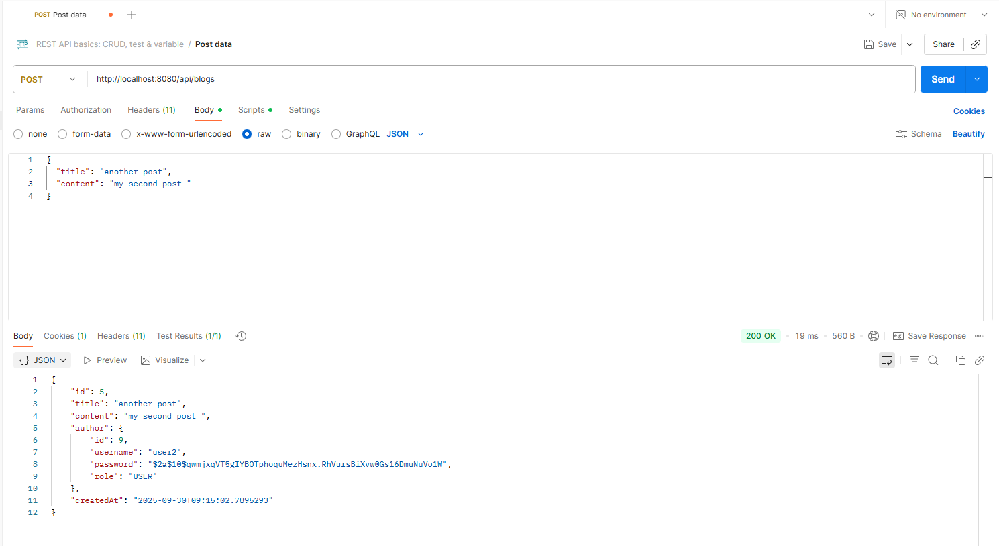 | Ảnh (API) | Mô tả một yêu cầu **POST** (ví dụ: tạo người dùng hoặc tạo bài blog). |
| **`application.properties`** | Cấu hình | Tệp cấu hình chính của ứng dụng (ví dụ: Spring Boot), chứa các thiết lập cơ sở dữ liệu, cổng, v.v. |
| 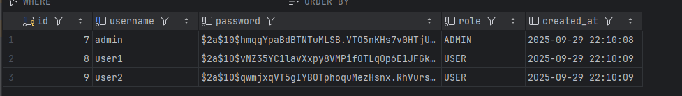 | Ảnh (DB) | Minh họa cấu trúc hoặc dữ liệu mẫu của bảng/collection **Users**. |
| 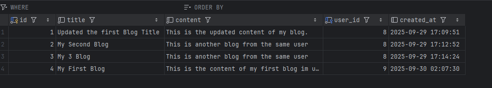 | Ảnh (DB) | Minh họa cấu trúc hoặc dữ liệu mẫu của bảng/collection **Blogs**. |
| 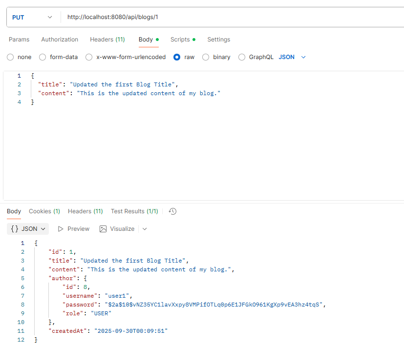 | Ảnh (API) | Mô tả một yêu cầu **PUT** (Cập nhật tài nguyên). |
| 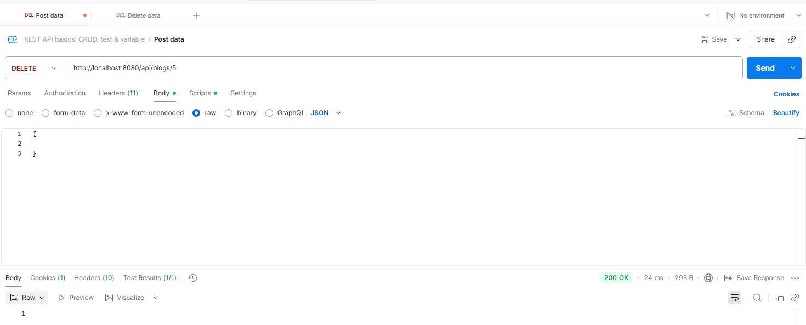 | Ảnh (API) | Minh họa chức năng xóa một bài đăng. |
| 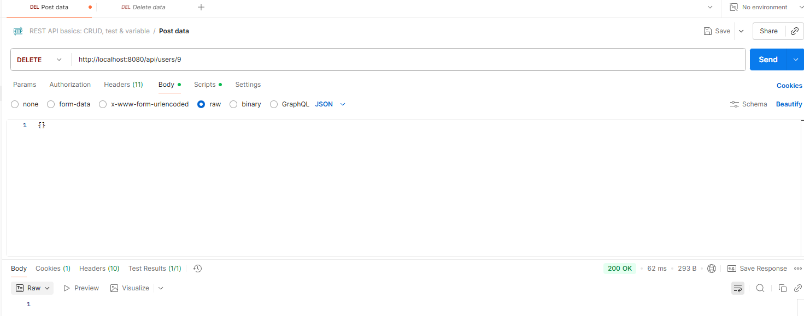 | Ảnh (API) | Minh họa chức năng xóa một người dùng. |
| 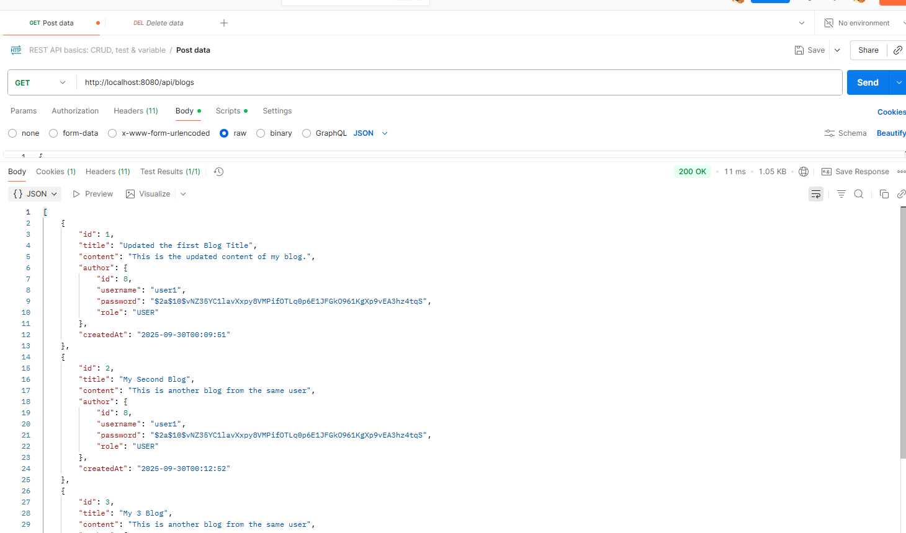 | Ảnh (API) | Minh họa yêu cầu **GET** thông thường (ví dụ: xem hồ sơ cá nhân). |
| 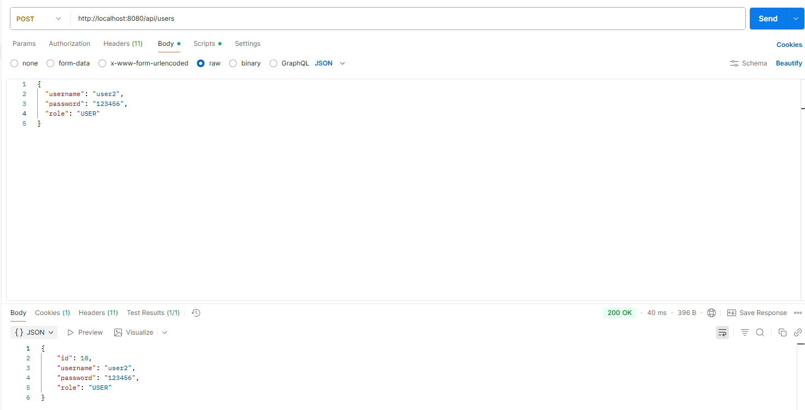 | Ảnh (Admin) | Minh họa chức năng **Admin** tạo tài khoản người dùng mới. |
| 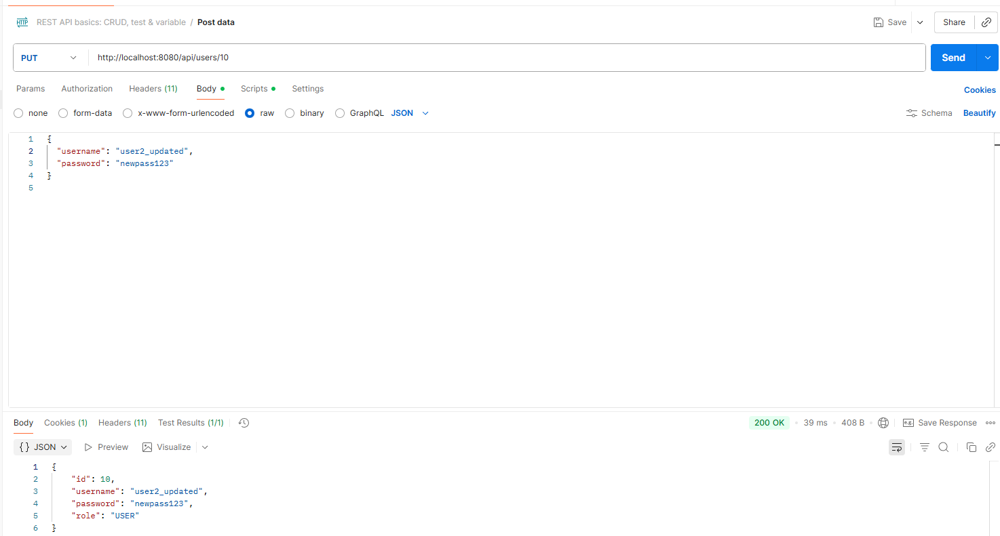 | Ảnh (Admin) | Minh họa chức năng **Admin** thay đổi thông tin người dùng. |
| 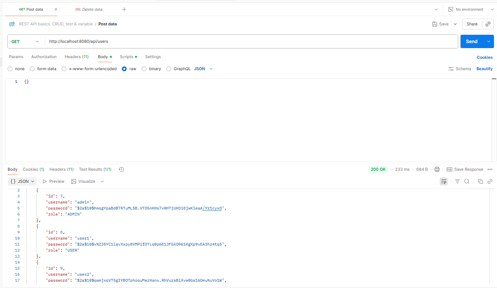 | Ảnh (Admin) | Minh họa yêu cầu **GET** dành cho Admin (ví dụ: xem danh sách tất cả người dùng). |
| 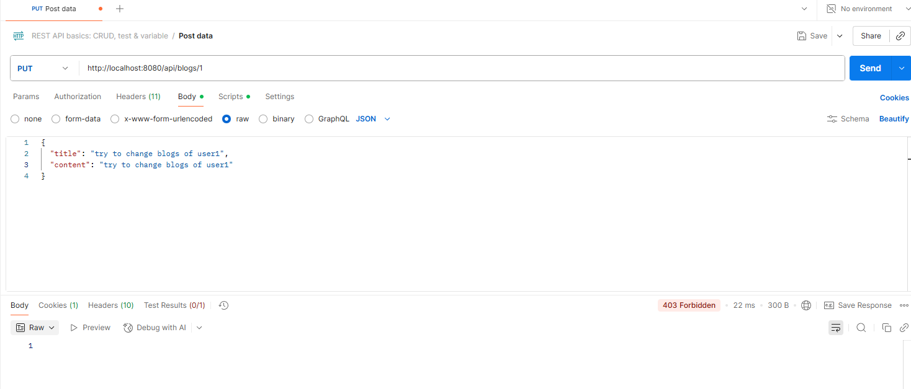 | Ảnh (API) | user không thể thay đổi blog của người khác. |

---

## 🔗 Các Endpoint API Quan Trọng

*(Dựa trên các tệp ảnh, đây là các chức năng chính mà API cung cấp. Bạn cần điều chỉnh đường dẫn cho đúng với dự án thực tế.)*

| Chức năng | Phương thức | Endpoint (Ví dụ) | Quyền truy cập |
| :--- | :--- | :--- | :--- |
| Tạo Tài nguyên | `POST` | `/api/blogs` hoặc `/api/users` | USER/PUBLIC |
| Cập nhật Tài nguyên | `PUT` | `/api/blogs/{id}` | USER/ADMIN |
| **Xóa Blog** | `DELETE` | `/api/blogs/{id}` | USER/ADMIN |
| **Admin** Lấy dữ liệu | `GET` | `/api/admin/users` | ADMIN |
| **Admin** Thay đổi User | `PUT` | `/api/admin/users/{id}` | ADMIN |
| **Admin** Xóa User | `DELETE` | `/api/admin/users/{id}` | ADMIN |

---

